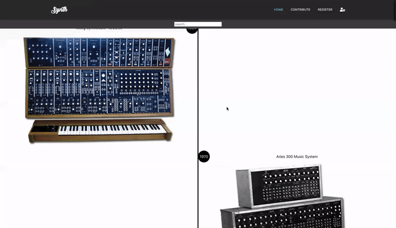

# Synthesizer Director :sound:

:fire:[Synthesizer Directory](https://synthesizer-directory.netlify.app/):fire:  

:fire:[Synthesizer API Explorer!](https://synthesizer-api.netlify.app/):fire:
:fire:[Synthesizer API repo](https://github.com/BernardDev/Synthesizer-API):fire:

---

## About this Project

 

This frontend is built upon my Synthesizer API. The project aim's to offer an appealing and visual scrolling experience while exploring the history of synthesizers. On a vertical timeline synthesizers are displayed sorted by year of production. When a manufacturers is queried only synths from that manufacturers are displayed. Users can contribute by suggesting new synthesizers. A login system is used to make admins able to decline or accept these suggestions and add them to the collection.

### Leading topics:

 

> [INFINITE SCROLLING](https://github.com/BernardDev/Synthesizer-directory)  

On the main page images pop-up from both sides with [CSS Animations](#). When the limit has been reached of the fetched synths a new batch is fetched on observing the last element. To make this happen I utilized [Intersection Observer](#). There was also a need for a reference to the an actual DOM element, therfore UseRef was explored (together with UseCallback).

 

> [STYLED COMPONENTS](https://github.com/BernardDev/Synthesizer-directory)  

Making this frontend gave me the chance of exploring more tools in my styling toolbox. Since I am working in React, [Styled Components](#) seemed fitting. It blends in so well with React's inner working and is nice to combine with Sass.

 

> [VALIDATION & ERROR HANDLING](https://github.com/BernardDev/Synthesizer-API/tree/development/server)  

Validation was done with [Yup](https://github.com/BernardDev/Synthesizer-directory/tree/development). It aim's to deliver meaningful feedback to the client when an mistake occurs. Also validated in front and backend: multipart/form-data & attachments.
 

> [USECONTEXT](https://github.com/BernardDev/Synthesizer-directory/tree/development)  
> 
To store the JWT token, aquired from a succesfull admin registration and login, [UseContext](#) is used.

 

> [STICKY ADVANCED](https://github.com/BernardDev/Synthesizer-directory/tree/development)  
> 
To be able to get only the new years stick to the top when scrolling through the synthesizer [this](#) construction is used.

 

### Things I've done in the frontend:

|                              |                         |                          |                       |
| ---------------------------- | ----------------------- | ------------------------ | --------------------- |
| CSS Animation                | fetching data           | React Hook Form          | custom Hooks          |
| validation                   | error handling          | Intersection Observer :star: | Styled Components |
| UseCallback :star:           | UseRef :star:           | lazy loading             | pagination            |
| Yup                          | handling file upload    | styling file upload      | multipart/form-data :star: |
| Multer :star:                | creating svg's          | UseContext               | autocomplete          |
| Axios cancel token           | prevState :star:        | sticky (advanced)        | Playwright            |
| frontend JWT                 |                         |                          |                       |

 

:star: _New technologies learned in this project_

 

### User Stories

- As a User I want to be able to be able to see synthesizers, so I can satisfy my needs 
- As a User I want to be able to be able to see synthesizers sorted by the year the are produced, so I can get a feeling for their history
- As a User I want to be able to be able to query all synthesizers from one specific manufacturers, so I can only look for 'Roland' synthesizers
- As a User I want to be able to be able to know what manufacturers I can choose from, so I get the data I'm looking for
- As a User I want to be able to contribute to the collection, so I can help make this the biggest directory of synthesizers out there
- As a User I want to be able to know what is not allowed when suggesting a new synthesizer, so I can do it in a swift manner
- As Myself I want to be able to judge the suggested synthesizer, so I can decide which one's will be added to the collection

- [ ] As a User I want to be able to filter and sort synthesizers on options other then year they are produced   

 

### Wireframes Synthesizer Directory

- Checkout the wireframes made for the [Synthesizer Directory](https://github.com/BernardDev/).

 

### Git Version Control

...

 
